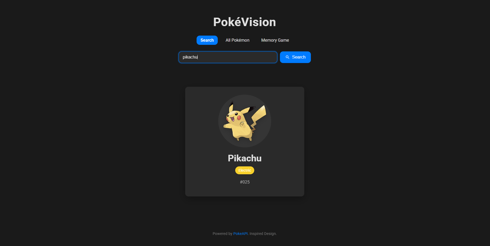
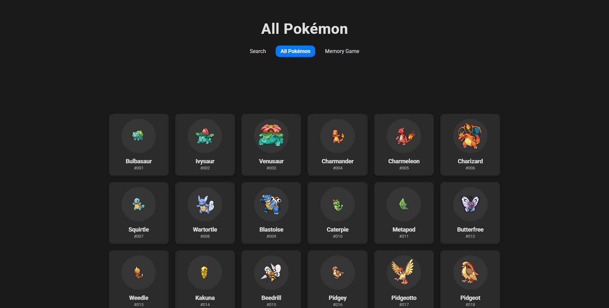
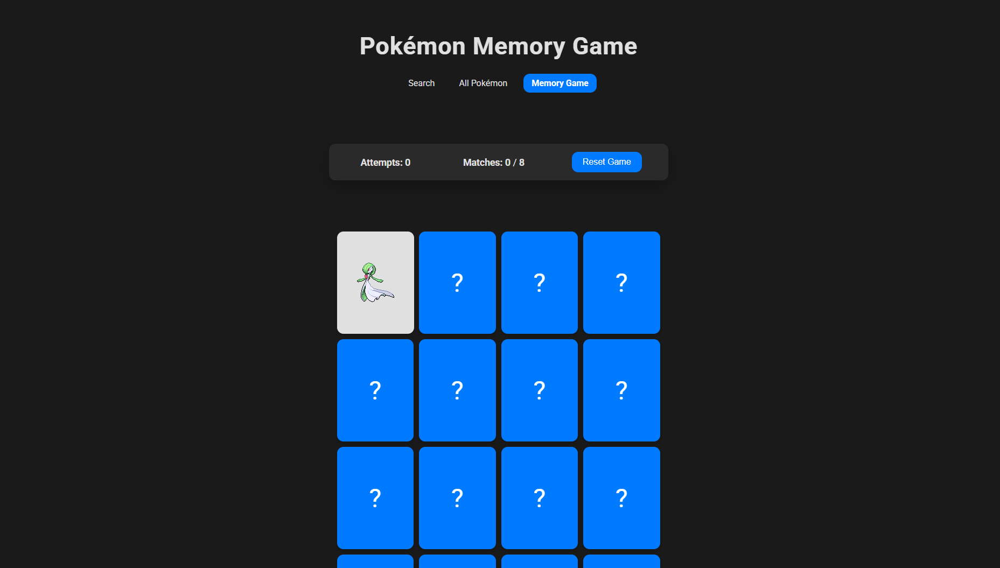

# PokéVision: Pokémon Finder & Mini-Games

PokéVision is a dynamic web application built with vanilla JavaScript, HTML, and CSS that allows users to interact with the [PokeAPI](https://pokeapi.co/). Users can search for Pokémon, view a comprehensive list of all Pokémon, and play a fun Pokémon-themed memory game.

This project was created to demonstrate understanding of JavaScript Objects, the DOM, asynchronous JavaScript (Fetch API, async/await), and dynamic web page updates.

**Live Demo:** https://aldonvacriates.github.io/poke-vision-app/memory-game.html

## Features

🌟 **Pokémon Search:**
    *   Input a Pokémon's name or National Pokédex ID.
    *   View the Pokémon's name, official artwork (or default sprite), and type(s).
    *   Dynamic updates to the page based on API response.
    *   Basic error handling for not-found Pokémon or API issues.
    *   Inspired, clean UI with animations.

📖 **All Pokémon List:**
    *   Browse a paginated list of all available Pokémon.
    *   Each entry displays the Pokémon's sprite, name, and ID.
    *   Clicking a Pokémon in the list navigates to the Search page and auto-searches for it.
    *   Responsive grid layout.

🧠 **Pokémon Memory Game:**
    *   Classic card-matching memory game with Pokémon sprites.
    *   Tracks the number of attempts and matched pairs.
    *   Option to reset the game.
    *   Dynamic board generation with a configurable number of pairs.

## Technologies Used

*   **HTML5:** For structuring the web pages.
*   **CSS3:** For styling, layout (Flexbox, Grid), and animations.
*   **Vanilla JavaScript (ES6+):** For all application logic, DOM manipulation, and interactivity.
    *   **Fetch API & Async/Await:** For making asynchronous requests to the PokeAPI.
*   **PokeAPI:** The source of all Pokémon data.


## Getting Started

To run this project locally, follow these steps:

1.  **Clone the repository (or download the ZIP):**
    ```bash
    git clone git@github.com:Aldonvacriates/poke-vision-app.git
    ```
    https://github.com/Aldonvacriates/poke-vision-app
    Alternatively, download the project files as a ZIP and extract them.

2.  **Navigate to the project directory:**
    ```bash
    cd your-repo-name
    ```

3.  **Open `index.html` in your web browser:**
    *   Simply double-click the `index.html` file, or right-click and choose "Open with" your preferred browser.
    *   No build steps or local server (like Live Server) is strictly required, but using one can enhance the development experience with auto-reloading.

## Usage

*   **Search Page (`index.html`):**
    *   Type a Pokémon's name (e.g., "pikachu", "charizard") or its National Pokédex ID (e.g., "25", "6") into the input field.
    *   Click the "Search" button or press Enter.
    *   The Pokémon's details (image, name, ID, types) will appear.
    *   An error message will be shown for invalid searches.
*   **All Pokémon Page (`all-pokemon.html`):**
    *   Navigate to this page using the "All Pokémon" link in the header.
    *   The page will load and display a grid of Pokémon.
    *   Use the "Previous" and "Next" buttons for pagination.
    *   Click on any Pokémon card to be taken to the Search page, pre-filled with that Pokémon.
*   **Memory Game Page (`memory-game.html`):**
    *   Navigate to this page using the "Memory Game" link in the header.
    *   The game board will be set up with pairs of Pokémon cards.
    *   Click on cards to flip them and try to find matching pairs.
    *   The game tracks your attempts and matches.
    *   Click "Reset Game" to start a new game.

## Screenshots


*   **Search Page:**
    ''

*   **All Pokémon List Page:**
    ''

*   **Memory Game Page:**
    ''

To add screenshots:
1. Take screenshots of your application.
2. Add them to your project folder (e.g., in an `assets/images/` subfolder).
3. Update the markdown like this: ``

## Future Enhancements (Optional)

*   More detailed Pokémon information (stats, abilities, evolutions).
*   Filtering and sorting options on the "All Pokémon" page.
*   Different difficulty levels for the Memory Game.
*   Saving high scores for the Memory Game (using LocalStorage).
*   Improved error handling and user feedback.
*   A more robust solution for fetching all Pokémon if the total number grows significantly beyond PokeAPI's `limit` capabilities for a single call.

---

This project was created as part of an assignment to demonstrate JavaScript, DOM manipulation, and API interaction skills.